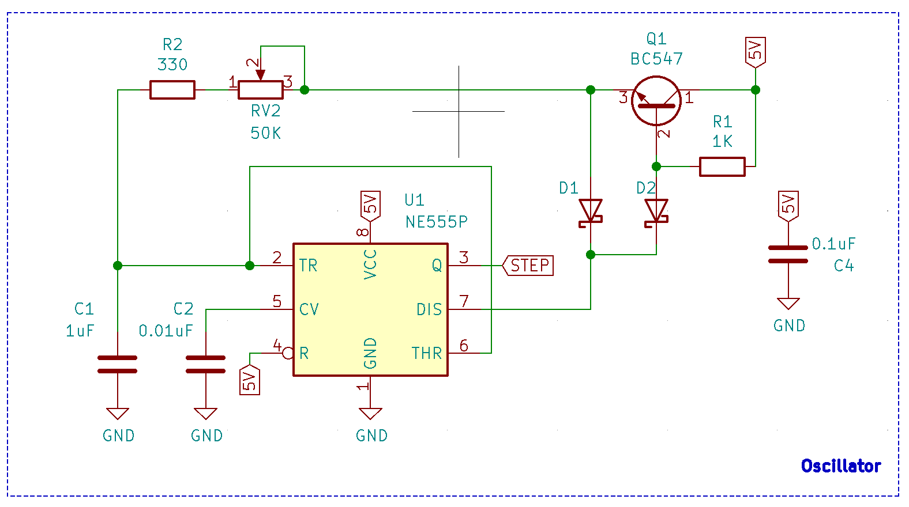
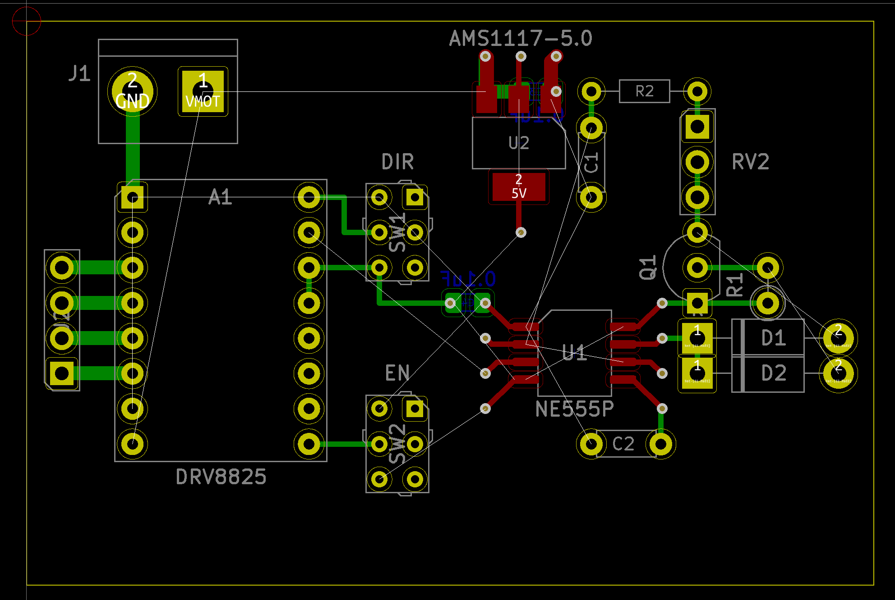

# Stepper motor tester

Simple stepper motor tester designed around stuff I've had laying around: standart 0.1" perf board, 555 timer, 1117 voltage regulator and some passives.

Oscillator design is 50% duty cycle astable 555 timer.

PCB design has mix of SMD and TH components simply because that is what I have at the moment. It turns out you can mix those types of components quite easily on perfboard :) Ratsnet is showing flywires, tracks are created using solder bridges.

